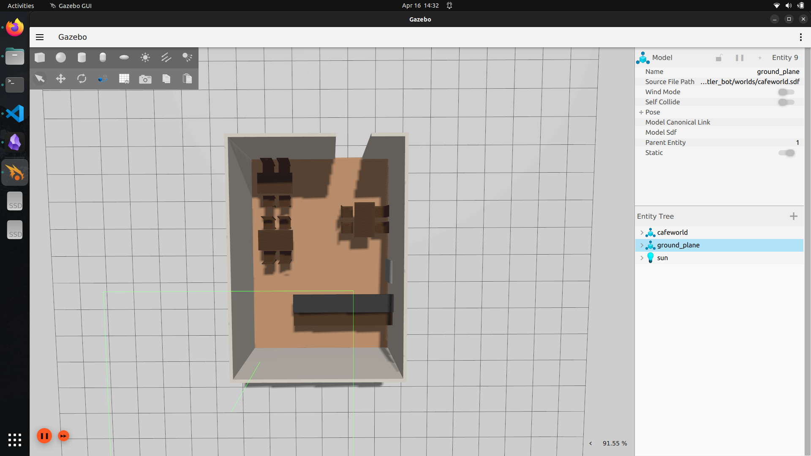
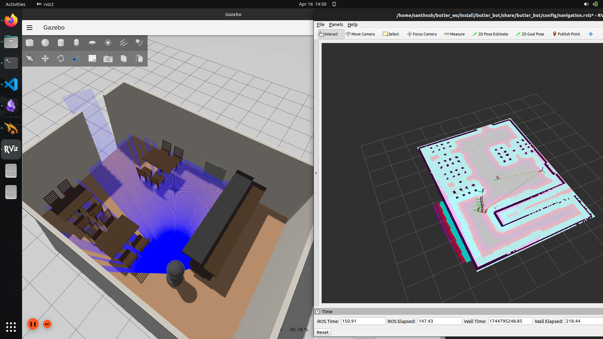

---

# 🤖 ROS 2 Butler Robot for Café Automation

This project implements a **ROS 2-based autonomous butler robot** designed to deliver food orders in a café environment. Built as a solution for the French Door Café Automation Task, it utilizes **Ignition Gazebo** for simulation and the **Nav2 Stack** for navigation.

---

## 📌 Features

- 🧭 Autonomous navigation using ROS 2 Nav2 stack  
- 🏠 Return-to-home logic after deliveries or timeouts  
- 🕒 Timeout handling at kitchen and customer tables  
- ✅ Confirmation and ❌ cancellation via CLI or services  
- 📦 Multi-order handling with delivery optimization  
- 🧱 Custom café world modeled in Fusion 360 & Blender  
- 🔧 Modular launch system and custom URDF robot model  

---

## 🧩 Problem Statement

The robot must:
- Travel from **home → kitchen → table → home**
- Wait for confirmation at kitchen/table (with timeout)
- Handle cancellations during task
- Support multiple concurrent orders
- Return to kitchen before home if table fails confirmation


---

## 🛠️ Installation & Setup

### 1. Create Workspace

```bash
mkdir -p ~/butler_ws/src
cd ~/butler_ws/src
git clone https://github.com/SANTH0SH-K/butler_bot.git
cd ..
rosdep install --from-paths src --ignore-src -r -y
colcon build
source install/setup.bash
```

### 2. Launch Café Environment + Robot

```bash
ros2 launch butler_bot ign.launch.py
```

### 3. Start Navigation & RViz

```bash
# In a new terminal
source ~/butler_ws/install/setup.bash
ros2 launch butler_bot navigation2.launch.py
```

---

## 🚀 Usage

### Place Order (Send to table)

```bash
ros2 topic pub /order std_msgs/String "data: 'table2'" --once
```

### Confirm Delivery (At kitchen/table)

```bash
ros2 topic pub /confirmation std_msgs/String "data: 'confirmed'" --once
```

### Cancel Delivery

```bash
ros2 topic pub /cancel std_msgs/String "data: 'cancel'" --once
```

---

## 🧪 Test Scenarios

| Scenario                         | Expected Outcome                                     | Status |
|----------------------------------|------------------------------------------------------|--------|
| Single Order                     | Kitchen → Table → Home                               | ✅     |
| Timeout at Kitchen               | Return to Home                                       | ✅     |
| Timeout at Table                 | Return to Kitchen → Home                             | ✅     |
| Cancel on Route to Kitchen       | Return to Home                                       | ✅     |
| Cancel on Route to Table         | Return to Kitchen → Home                             | ✅     |
| Multiple Orders (All Confirmed)  | Deliver to all → Return Home                         | ✅     |
| Multiple Orders w/ Timeout       | Skip table → Complete others → Kitchen → Home        | ✅     |
| Multiple Orders w/ Cancellation  | Skip canceled table → Deliver others → Kitchen → Home| ✅     |

---

## 📂 Project Structure

```
butler_bot/
├── config/
├── launch/
├── maps/
├── models/
├── meshes/
├── params/
├── scripts/
├── tests/
├── urdf/
├── worlds/
├── CMakeLists.txt
├── ROS2 BASED BUTLER BOT USING CUSTOM ROBOT.pdf
└── package.xml
```

---

## 🛠 Tech Stack

- ROS 2 Humble
- Ignition Gazebo Fortress
- Navigation2
- Fusion 360 → URDF Export
- Python 
- RViz2

---

## 📸 Screenshots






---

